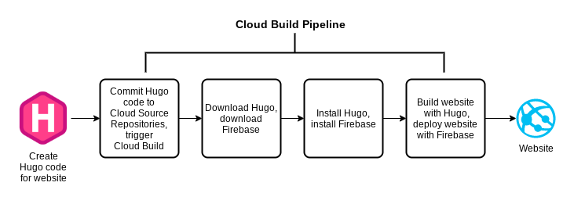

# Hugo deployment with Firebase on Google Cloud Platform

---



---

This project demonstrates a fully automated CI/CD pipeline for deploying a **static Hugo site** to **Firebase Hosting** using **Google Cloud Build**. All site content and configuration live in a GitHub repository; on every commit to `master`, Cloud Build:

1. Fetches the specified version of Hugo and Firebase CLI
2. Builds the site static assets
3. Deploys them to Firebase Hosting

The result is a zero-touch workflow: no SSH, no manual clicks, and instant, consistent rollouts.

---

## Hugo & Firebase

Welcome to this tutorial on building a static site with **Hugo** and deploying it to **Firebase Hosting**. We'll cover:

1. **What is Hugo?**
2. **Business Case for Hugo**
3. **Hugo Architecture & Components**
4. **Building & Serving Locally**
5. **Introduction to Firebase**
6. **Deploying Hugo to Firebase**

---

## 1. What Is Hugo?

Hugo is a **fast**, **flexible**, open-source static site generator written in Go. It converts content written in Markdown (or other formats) into a complete, ready-to-serve website—HTML, CSS, and JavaScript—without the need for a server-side runtime.

### Key Features

- **Speed:** Builds sites in milliseconds, even with thousands of pages.
- **Flexibility:** Supports custom themes, layouts, and data files.
- **Ease of Use:** Simple commands for scaffolding, building, and serving content.

## 2. Business Case for Hugo

- **Performance & SEO**: Static pages load quickly and are easily crawled by search engines.
- **Cost Savings**: No server or runtime, only storage and CDN costs.
- **Security**: No backend reduces attack surface—no database, no server code.
- **Developer Productivity**: Git-based workflow with instant previews accelerates iteration.

## 3. Hugo Architecture & Components

Hugo projects follow a standardized directory layout:

```text
my-site/
├── archetypes/      # Templates for new content
├── content/         # Markdown files for pages and posts
├── data/            # Custom data in YAML, JSON, or TOML
├── layouts/         # HTML templates & partials
├── resources/       # Processed assets (CSS, JS, images)
├── static/          # Static assets copied as-is
└── config.toml      # Site configuration
```

### Component Breakdown

- **Archetypes**: Predefined front-matter templates (`hugo new post/my-first.md`).
- **Content**: Your site’s pages, written in Markdown with front-matter metadata.
- **Layouts & Partials**: Go HTML templates that define page structure and reusable snippets.
- **Data Files**: Structured data for menus, authors, or any custom use.
- **Static Assets**: CSS, JavaScript, and images served directly.
- **Configuration**: `config.toml` defines site params, theme selection, baseURL, and output formats.

## 4. Building & Serving Locally

1. **Install Hugo** (Extended for SCSS support):

   ```bash
   wget -qO hugo.tar.gz \
     https://github.com/gohugoio/hugo/releases/download/v0.96.0/hugo_extended_0.96.0_Linux-64bit.tar.gz
   tar -xzf hugo.tar.gz -C /usr/local/bin
   ```

2. **Create a New Site**:

   ```bash
   hugo new site my-site
   cd my-site
   ```

3. **Add a Theme** (e.g., Hello Friend NG):

   ```bash
   git clone https://github.com/rhazdon/hugo-theme-hello-friend-ng.git themes/hello-friend-ng
   echo 'theme = "hello-friend-ng"' >> config.toml
   ```

4. **Add Content**:

   ```bash
   hugo new posts/hello-world.md
   # Edit content in content/posts/hello-world.md
   ```

5. **Run Local Server**:

   ```bash
   hugo server -D --bind 0.0.0.0 --port 1313
   # Visit http://localhost:1313
   ```

## 5. Introduction to Firebase

**Firebase Hosting** is a fully-managed hosting service for static and dynamic content, delivered over a global CDN with free SSL certificates.

### Firebase Benefits

- **Global CDN**: Fast content delivery worldwide.
- **Free SSL**: Automatic HTTPS with custom domains.
- **Integrations**: CLI, GitHub Actions, and SDKs for rich features.

## 6. Deploying Hugo to Firebase

1. **Install Firebase CLI**:

   ```bash
   curl -sL https://firebase.tools | bash
   ```

2. **Initialize Hosting**:

   ```bash
   firebase init hosting
   # Select project → public directory: public → single-page app? N
   ```

3. **Build Hugo Site**:

   ```bash
   hugo   # Generates /public folder
   ```

4. **Deploy**:

   ```bash
   firebase deploy --only hosting
   ```

5. **Access Your Site**:
   After deployment, note the Firebase URL (e.g., `https://your-project.web.app`) and visit it—you’re live!

---

_This short course provided a high-level overview of Hugo’s static-site capabilities and Firebase’s hosting power. Explore each section in-depth to master your own blazing-fast, secure, and cost-efficient web presence!_

---

## Business Case

- **Performance & Scalability**
  Pre-rendered HTML/CSS/JS served directly from a global CDN delivers sub-100 ms page loads at any scale.
- **Cost Efficiency**
  Eliminates always-on servers—pay only for storage and bandwidth, not VM uptime or container runtime.
- **Security & Reliability**
  Static assets shrink the attack surface: no server-side code, no OS patches, and no runtime dependencies to manage.
- **Developer Velocity**
  Git-driven workflows + CI/CD allow teams to ship site changes in seconds, with full version history, peer reviews, and easy rollbacks.

---

## Static-Site Deployment - Manual

Below is a consolidated **playbook** you can drop into your repo’s README.md. It walks through the **manual** Hugo→Firebase workflow you just completed—and calls out the key business drivers and technical concepts at each step.

---

## Static-Site Deployment Playbook

### 1. Business Use Cases

- **Performance & Scalability**
  Pre-rendered HTML/CSS/JS served directly from a CDN yields sub-100 ms page loads at any scale.
- **Cost Efficiency**
  No always-running web server means you pay only for storage and egress, not VM or container uptime.
- **Security & Reliability**
  With no server-side code, your attack surface shrinks—no OS patches or runtime dependencies to manage.
- **Developer Velocity**
  Git-driven workflows + CI/CD pipelines let teams ship site changes in seconds, with full version history and easy rollbacks.

---

### 2. Prerequisites

- A **GCP project** with billing enabled.
- A **Linux VM** (e.g. Compute Engine) or local machine with:

  - `git` & [`gh`](https://cli.github.com/) installed
  - `gcloud` SDK installed & authenticated
  - External SSH access (for VM)

- A **GitHub account** for hosting your site repo.
- A **Firebase project** (we’ll pick it during `firebase init`).

---

### 3. Step 1: Install Hugo Locally

```bash
# 1. SSH into your Linux VM
# 2. Examine helper script
# 3. Run script to download & extract Hugo Extended
student-00-56d75bd2ad6d@hugo-dev-vm:~$ cat /tmp/installhugo.sh
_HUGO_VERSION=0.96.0
curl -L https://github.com/gohugoio/hugo/releases/download/v${_HUGO_VERSION}/hugo_extended_${_HUGO_VERSION}_Linux-64bit.tar.gz | tar -xz -C /tmp/
# echo The Hugo binary is now at /tmp/hugo.

# 3. Run script to download & extract Hugo Extended
cd ~
/tmp/installhugo.sh

# 4. Verify:
ls -l /tmp/hugo     # Hugo binary
```

**Concepts Covered**

- **Binary distribution** with `wget` → `tar`
- Hugo’s **Extended Edition** bundles Sass/SCSS support for advanced theming.

---

### 4. Step 2: Create & Clone GitHub Repo

```bash
# 1. Set GCP-related env vars
export PROJECT_ID=$(gcloud config get-value project)
export PROJECT_NUMBER=$(gcloud projects describe $PROJECT_ID \
  --format="value(projectNumber)")
export REGION=$(gcloud compute project-info describe \
  --format="value(commonInstanceMetadata.items[google-compute-default-region])")

# 2. Install Git tooling
sudo apt-get update
sudo apt-get install -y git gh

# 3. Authenticate to GitHub CLI & configure git user
gh auth login
GITHUB_USERNAME=$(gh api user -q ".login")
git config --global user.name  "$GITHUB_USERNAME"
git config --global user.email "$USER_EMAIL"

# 4. Create & clone your site repo
gh repo create my_hugo_site --private
gh repo clone my_hugo_site
```

**Concepts Covered**

- **Environment variables** for later pipeline use
- **GitHub CLI** accelerates repo creation vs. UI
- **Version control** of both site content & pipeline configs

---

### 5. Step 3: Scaffold Hugo Site & Install Theme

```bash
cd ~/my_hugo_site
# 1. Scaffold Hugo project into existing folder
/tmp/hugo new site . --force

# 2. Add a community theme
git clone \
  https://github.com/rhazdon/hugo-theme-hello-friend-ng.git themes/hello-friend-ng
echo 'theme = "hello-friend-ng"' >> config.toml

# 3. Remove theme’s own .git metadata
rm -rf themes/hello-friend-ng/.git themes/hello-friend-ng/.gitignore
```

**Concepts Covered**

- Hugo’s **site scaffold**: directory layout under `/content`, `/layouts`, `/static`
- **Theming**: decouple look-and-feel from content
- **Git hygiene**: avoid nested repositories

---

### 6. Step 4: Preview Locally with Hugo Server

```bash
# 1. In the site root
/tmp/hugo server -D --bind 0.0.0.0 --port 8080

# 2. In your browser:
http://[EXTERNAL_IP]:8080
# 3. When done: CTRL+C
```

**Concepts Covered**

- Local **live-reload** server for iterative theming/content edits
- `-D` flag to include draft posts

---

### 7. Step 5: Install & Initialize Firebase Hosting

```bash
# 1. Install Firebase CLI
curl -sL https://firebase.tools | bash

# 2. Initialize hosting in your site folder
cd ~/my_hugo_site
firebase init
```

During `firebase init`:

- Choose **Hosting**
- **Use existing project** → pick your GCP project
- **Public directory**: `public`
- **Single-page app?** → No
- **GitHub Action deploys?** → No

**Concepts Covered**

- Firebase CLI vs. manual GCS bucket setup
- Mapping Hugo’s `/public` → Firebase Hosting target

---

### 8. Step 6: Manual Build & Deploy

```bash
# 1. Build the site
/tmp/hugo

# 2. Push to Firebase CDN
firebase deploy
```

After deploy, Firebase returns your site URL (e.g. `https://your-project.web.app`). It takes \~1–2 minutes to propagate through Google’s CDN.

**Concepts Covered**

- One-command **static build** vs. incremental server builds
- **CI/CD precursor**: manual deploy is your baseline for Cloud Build automation

---

### 9. Next Steps

Once you’ve confirmed the manual flow works end-to-end, you can automate:

1. **Cloud Build** pipeline triggered on `git push`
2. Steps to:

   - Checkout code
   - Install Hugo
   - Build site
   - Deploy via Firebase CLI

That fully codifies your CI/CD process—no SSH, no VM, zero manual clicks.

---

<small>ℹ️ This playbook assumes HTTP(s) → Firebase Hosting. If you need a custom domain or SSL certificate, Firebase Hosting can provision managed SSL automatically once you point your DNS.</small>

## Static-Site Deployment Playbook - Automated

### 1. Business Use Cases

- **Performance & Scalability**
  Pre-rendered HTML/CSS/JS served directly from a CDN yields sub-100 ms page loads at any scale.
- **Cost Efficiency**
  No always-running web server means you pay only for storage and egress, not VM or container uptime.
- **Security & Reliability**
  With no server-side code, your attack surface shrinks—no OS patches or runtime dependencies to manage.
- **Developer Velocity**
  Git-driven workflows + CI/CD pipelines let teams ship site changes in seconds, with full version history and easy rollbacks.

### 2. Prerequisites

- A **GCP project** with billing enabled.
- A **Linux VM** (e.g., Compute Engine) or local machine with:

  - `git` & [`gh`](https://cli.github.com/) installed
  - `gcloud` SDK installed & authenticated
  - External SSH access (for VM)

- A **GitHub account** for hosting your site repo.
- A **Firebase project** (we’ll pick it during `firebase init`).

### 3. Step 1: Install Hugo Locally

```bash
# 1. SSH into your Linux VM
# 2. Examine helper script
cat /tmp/installhugo.sh

# 3. Run script to download & extract Hugo Extended
cd ~
/tmp/installhugo.sh

# 4. Verify:
ls -l /tmp/hugo     # Hugo binary
```

**Concepts Covered**

- **Binary distribution** with `wget` → `tar`
- Hugo’s **Extended Edition** bundles Sass/SCSS support for advanced theming.

### 4. Step 2: Create & Clone GitHub Repo

```bash
# 1. Set GCP-related env vars
export PROJECT_ID=$(gcloud config get-value project)
export PROJECT_NUMBER=$(gcloud projects describe $PROJECT_ID \
  --format="value(projectNumber)")
export REGION=$(gcloud compute project-info describe \
  --format="value(commonInstanceMetadata.items[google-compute-default-region])")

# 2. Install Git tooling
sudo apt-get update
sudo apt-get install -y git gh

# 3. Authenticate to GitHub CLI & configure git user
gh auth login
GITHUB_USERNAME=$(gh api user -q ".login")
git config --global user.name  "$GITHUB_USERNAME"
git config --global user.email "$USER_EMAIL"

# 4. Create & clone your site repogh repo
gh repo create my_hugo_site --private
gh repo clone my_hugo_site
```

**Concepts Covered**

- **Environment variables** for later pipeline use
- **GitHub CLI** accelerates repo creation vs. UI
- **Version control** of both site content & pipeline configs

### 5. Step 3: Scaffold Hugo Site & Install Theme

```bash
cd ~/my_hugo_site
# 1. Scaffold Hugo project into existing folder
/tmp/hugo new site . --force

# 2. Add a community theme
git clone \
  https://github.com/rhazdon/hugo-theme-hello-friend-ng.git themes/hello-friend-ng
echo 'theme = "hello-friend-ng"' >> config.toml

# 3. Remove theme’s own .git metadata
rm -rf themes/hello-friend-ng/.git themes/hello-friend-ng/.gitignore
```

**Concepts Covered**

- Hugo’s **site scaffold**: `/content`, `/layouts`, `/static`
- **Theming**: decouple look-and-feel from content
- **Git hygiene**: avoid nested repositories

### 6. Step 4: Preview Locally with Hugo Server

```bash
# 1. In the site root
/tmp/hugo server -D --bind 0.0.0.0 --port 8080

# 2. In your browser:
http://[EXTERNAL_IP]:8080
# 3. When done: CTRL+C
```

**Concepts Covered**

- Local **live-reload** server for iterative theming/content edits
- `-D` flag to include draft posts

### 7. Step 5: Install & Initialize Firebase Hosting

```bash
# 1. Install Firebase CLI
curl -sL https://firebase.tools | bash

# 2. Initialize hosting in your site folder
cd ~/my_hugo_site
firebase init
```

**Concepts Covered**

- Firebase CLI vs. manual GCS bucket setup
- Mapping Hugo’s `/public` → Firebase Hosting target

### 8. Step 6: Manual Build & Deploy

```bash
# 1. Build the site
/tmp/hugo

# 2. Push to Firebase CDN
firebase deploy
```

**Concepts Covered**

- One-command **static build** vs. incremental server builds
- **CI/CD precursor**: manual deploy is your baseline for Cloud Build automation

### 9. Step 7: Initial Commit for Automation

```bash
cd ~/my_hugo_site

# Set git identity for automated commits
git config --global user.name  "hugo"
git config --global user.email "hugo@blogger.com"

echo "resources" >> .gitignore

# Commit baseline for Cloud Build
git add .
git commit -m "Add initial Hugo site to GitHub"
git push -u origin master
```

**Concepts Covered**

- _Baseline commit_ for pipeline triggers
- _.gitignore_ to filter out build artifacts

### 10. Step 8: Add Cloud Build Config

```bash
cp /tmp/cloudbuild.yaml .
cat cloudbuild.yaml
```

_See comments in the file for step-by-step logic._

### 11. Step 9: Connect GitHub → Cloud Build

```bash
gcloud builds connections create github cloud-build-connection \
  --project=$PROJECT_ID --region=$REGION

gcloud builds connections describe cloud-build-connection \
  --project=$PROJECT_ID --region=$REGION
```

Authorize via the displayed `actionUri` in your browser, granting access to `my_hugo_site`.

```bash
gcloud builds repositories create hugo-website-build-repository \
  --remote-uri="https://github.com/${GITHUB_USERNAME}/my_hugo_site.git" \
  --connection="cloud-build-connection" --region=$REGION
```

### 12. Step 10: Create a Build Trigger

```bash
gcloud builds triggers create github \
  --name="auto-deploy-master" \
  --repository="projects/$PROJECT_ID/locations/$REGION/connections/cloud-build-connection/repositories/hugo-website-build-repository" \
  --build-config="cloudbuild.yaml" \
  --service-account="projects/$PROJECT_ID/serviceAccounts/$PROJECT_NUMBER-compute@developer.gserviceaccount.com" \
  --branch-pattern="^master$" \
  --region=$REGION
```

### 13. Step 11: Grant Build Permissions

```bash
gcloud projects add-iam-policy-binding $PROJECT_ID \
  --member="serviceAccount:$PROJECT_NUMBER@cloudbuild.gserviceaccount.com" \
  --role="roles/firebasehosting.admin"
```

### 14. Step 12: Test the Pipeline

```bash
# 1. Change site title
sed -i 's/title = .*/title = "Blogging with Hugo and Cloud Build"/' config.toml

# 2. Commit & push
git add .
git commit -m "Update site title"
git push

# 3. Monitor build
gcloud builds list --region=$REGION
BUILD_ID=$(gcloud builds list --filter="source.repoSource.branchName=master" --format="value(ID)" --limit=1 --region=$REGION)
gcloud builds log $BUILD_ID --region=$REGION

# 4. Retrieve Hosting URL
gcloud builds log $BUILD_ID --region=$REGION | grep "Hosting URL"

# 5. Browse the URL
```

---

_Your static site is now fully automated: push to Git → Cloud Build → Firebase Hosting._
